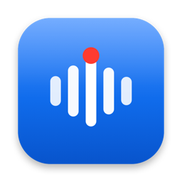

<div align="center">



# Locus

**Offline meeting transcription for macOS.**
Detects Zoom meetings & Slack huddles, asks permission, and produces a live, speaker-attributed transcript — then templated summaries via a model you control. Fully on-device.

</div>

---

## Status

This repository currently contains the **native SwiftUI front-end** — every screen and state, fully themed (light/dark) and building clean. It runs on in-memory sample data and simulated flows so the entire UX is explorable today.

The audio-capture (CoreAudio process taps + mic), on-device speech-to-text (Parakeet/Whisper), diarization, and LLM-summary engine are **not wired yet** — they plug in behind `AppState`'s actions. See [`DESIGN.md`](DESIGN.md) for the architecture and [`TASKS.md`](TASKS.md) for the build plan.

## Features (UI complete)

- **Menu-bar agent** with always-visible recording status + quick controls.
- **Consent-first capture** — default-deny; nothing records until you tap *Record*. Per-app Ask / Always / Never.
- **Live transcript** — speaker-attributed lines, input meters, listening / capture-error / paused states.
- **Library** of recordings with search.
- **Recording detail** — transcript with inline speaker rename + playback, and a **summary** panel with templates (Long Summary, One-on-One, Action Items & Decisions, Quick Notes, custom).
- **Settings** — detection rules, on-device STT models, your own AI endpoint (base URL + key + model), template editor, storage/retention, permissions.

## Tech

- **SwiftUI**, macOS 14.2+, Apple Silicon.
- A single `AppState` (`ObservableObject`) state machine drives every screen; a small `Theme` token system ports the design's light/dark palettes.
- Project is generated with **[XcodeGen](https://github.com/yonsson/XcodeGen)** from [`project.yml`](project.yml) (the source of truth — the `.xcodeproj` is git-ignored).

## Build & run

```bash
# one-time: install the project generator
brew install xcodegen

# generate the Xcode project and open it
xcodegen generate
open Locus.xcodeproj
# then Build & Run (⌘R)
```

Or from the command line:

```bash
xcodegen generate
xcodebuild -scheme Locus -configuration Debug build
```

## Project structure

```
Locus/
  LocusApp.swift                 # @main — MenuBarExtra agent + main Window
  Support/                       # Theme, Models + SampleData, AppState, Components
  MenuBar/MenuBarAgentView.swift # status item + popover
  Windows/MainWindowView.swift   # sidebar + screen router + consent overlay
  Overlays/ConsentPromptView.swift
  Screens/                       # Library, Live, RecordingDetail, Settings (+ Detail/, Settings/)
  Assets.xcassets/               # AppIcon
project.yml                      # XcodeGen manifest
DESIGN.md · TASKS.md · FUNCTIONAL_SPEC.md
```

The UI was implemented from a Claude Design prototype (`Locus.dc.html`).
